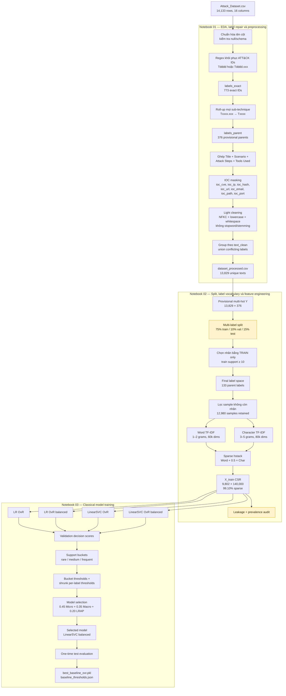
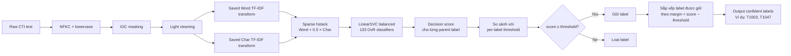
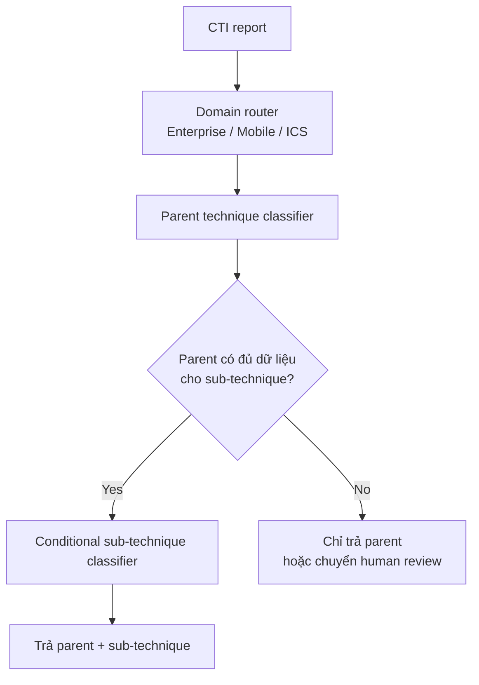

# Báo cáo tổng hợp dự án CTI → MITRE ATT&CK

> Snapshot kết quả: 28/06/2026. Báo cáo này tổng hợp trạng thái thực tế của ba notebook và các artifact hiện có. Các metric mới là **parent-technique level**, không được so trực tiếp như cùng một bài toán với metric sub-technique trước đây.

## 1. Tóm tắt điều hành

Dự án giải bài toán phân loại văn bản CTI đa nhãn sang MITRE ATT&CK. Pipeline ban đầu sử dụng 267 technique/sub-technique, TF-IDF + Word2Vec + tool one-hot và MLP dense. Pipeline hiện tại đã được chuyển sang baseline sparse, gộp toàn bộ sub-technique về parent, kết hợp Word TF-IDF và Character TF-IDF, sau đó huấn luyện các mô hình tuyến tính One-vs-Rest.

Kết quả tốt nhất hiện tại là `LinearSVC_balanced`:

| Metric test | Giá trị |
|---|---:|
| Micro-F1 | **0.5213** |
| Macro-F1 | **0.3969** |
| Samples-F1 | 0.4499 |
| LRAP | **0.6280** |
| Precision@1 | **0.5247** |
| Precision@3 | 0.2478 |
| Recall@3 | **0.6954** |
| Predicted labels/sample | 0.9353 |
| Hamming Loss | 0.00723 |

Đây là một baseline tốt để tiếp tục tối ưu mô hình truyền thống. Tuy nhiên, kết quả vẫn là **provisional** vì fallback splitter làm phân bố nhãn T1059 lệch mạnh giữa train, validation và test.

## 2. Mục tiêu và phạm vi hiện tại

- Input: mô tả CTI dạng tự do hoặc các trường `Title`, `Scenario Description`, `Attack Steps`, `Tools Used`.
- Output hiện tại: một hoặc nhiều **parent technique** như `T1003`, `T1047`.
- Bài toán: multi-label classification; xác suất/score của các nhãn độc lập và không cần cộng thành 100%.
- Phạm vi model hiện tại: 133 parent labels có support train tối thiểu 10.
- API inference hiện tại: chỉ trả những nhãn có decision score vượt threshold riêng của nhãn.

## 3. Khám phá dữ liệu

### 3.1 Dữ liệu thô

| Thuộc tính | Kết quả |
|---|---:|
| Số dòng ban đầu | 14,133 |
| Số cột | 16 |
| Dòng khôi phục được ít nhất một mã ATT&CK | 14,070 |
| Unique exact technique/sub-technique | 773 |
| Unique parent technique sau roll-up | 376 |
| Exact label cardinality | 1.086 nhãn/mẫu |
| Parent label cardinality | 1.085 nhãn/mẫu |

Dữ liệu cực kỳ thưa theo chiều nhãn: mỗi văn bản trung bình chỉ có hơn một nhãn. Vì vậy Hamming Loss dễ cho cảm giác tốt giả tạo; một model dự đoán rất ít hoặc toàn zero cũng có Hamming Loss thấp.

### 3.2 Lỗi cấu trúc CSV và nhãn

- Có hiện tượng mã MITRE bị lệch khỏi cột `MITRE Technique` sang các cột lân cận.
- Pipeline khôi phục mã bằng regex `Tdddd` hoặc `Tdddd.xxx` trong các cột recovery đã xác định.
- Mã exact được giữ trong `labels_exact`; mã parent được tạo bằng cách bỏ hậu tố `.xxx`.
- Việc roll-up làm bài toán ổn định hơn nhưng mất độ chi tiết sub-technique.
- Chưa có bước đối chiếu chính thức với ATT&CK STIX đã pin version, do đó vẫn có rủi ro mã deprecated, sai domain hoặc không còn hợp lệ.

### 3.3 Duplicate và leakage

- Trước dedupe: 14,070 dòng có nhãn.
- Sau dedupe: 13,829 dòng.
- Đã hợp nhất: 241 dòng trùng `text_clean`.
- Nếu cùng text nhưng có nhiều annotation, pipeline union nhãn thay vì âm thầm bỏ một annotation.
- Sau dedupe, exact text không xuất hiện đồng thời ở train/validation/test.

### 3.4 Long-tail ở parent level

| Thống kê parent label sau dedupe | Giá trị |
|---|---:|
| Tổng parent labels tạm thời | 376 |
| Support < 10 | 215 |
| Support < 20 | 263 |
| Median support | 7.5 |

Long-tail vẫn rất nghiêm trọng ngay cả sau khi gộp sub-technique về parent. Đây là nguyên nhân chính khiến nhiều nhãn không thể học ổn định.

## 4. Tiền xử lý hiện tại

### 4.1 Ghép văn bản

Các trường được ghép theo đúng thứ tự:

1. `Title`
2. `Scenario Description`
3. `Attack Steps`
4. `Tools Used`

Chỉ nên sử dụng các trường có thể tồn tại khi inference thực tế. Nếu production chỉ nhận một report tự do, cần kiểm thử domain shift so với dữ liệu có cấu trúc hiện tại.

### 4.2 IOC masking

Các thực thể biến động được chuẩn hóa thành token ổn định:

| Thực thể | Token |
|---|---|
| CVE | `ioc_cve` |
| IPv4/IPv6 | `ioc_ip` |
| Hash | `ioc_hash` |
| URL | `ioc_url` |
| Email | `ioc_email` |
| File path | `ioc_path` |
| Port | `ioc_port` |

Token được giữ lại thay vì xóa hoàn toàn, giúp model biết loại IOC mà không ghi nhớ giá trị cụ thể.

### 4.3 Làm sạch nhẹ

- Chuẩn hóa Unicode bằng NFKC.
- Lowercase.
- Chuẩn hóa khoảng trắng.
- Giữ `_`, `-`, `.`, `/`, `\\`, `:` để bảo toàn command, path và extension.
- Không stemming.
- Không xóa stopword hàng loạt.
- Giữ các từ quan trọng như `file`, `data`, `network`, `access`, `user`, `without`.

Quyết định không làm sạch quá mạnh đặc biệt quan trọng với ATT&CK vì nhiều technique được phân biệt bởi cặp hành động–đối tượng như `credential dumping`, `account discovery`, `process injection`, `remote service`.

## 5. Chia tập và xây dựng nhãn

### 5.1 Split ban đầu

| Tập | Trước lọc nhãn | Sau lọc nhãn train-support |
|---|---:|---:|
| Train | 10,373 | 9,802 |
| Validation | 1,382 | 1,276 |
| Test | 2,074 | 1,902 |
| Tổng | 13,829 | 12,980 |

849 mẫu, tương đương khoảng 6.1%, không còn nhãn thuộc vocabulary cuối cùng và bị loại khỏi benchmark.

### 5.2 Label vocabulary cuối cùng

- Vocabulary tạm thời: 376 parent labels.
- Chỉ giữ nhãn có `train support >= 10`.
- Vocabulary cuối cùng: 133 parent labels.
- Vocabulary được quyết định bằng train, không dùng validation/test.
- Mọi tập đều có representation của 133 nhãn, nhưng support của nhiều nhãn trong validation/test chỉ từ 1–5 mẫu.

### 5.3 Vấn đề của fallback splitter

Package `iterative-stratification` không có trong môi trường nên notebook dùng greedy fallback. Phần lớn nhãn được phân bổ tương đối gần, nhưng nhãn T1059 lệch nghiêm trọng:

| T1059 | Global rate | Train rate | Val rate | Test rate |
|---|---:|---:|---:|---:|
| Tỷ lệ | 5.71% | **7.57%** | **1.41%** | **1.52%** |
| Support | — | 742 | 18 | 29 |

Nguyên nhân: greedy fallback ưu tiên mẫu chứa nhãn hiếm trước; validation/test có thể hết capacity trước khi các mẫu của nhãn phổ biến được phân bổ. Do đó phải sửa split và chạy lại trước khi đóng băng benchmark.

## 6. Feature engineering

### 6.1 Word TF-IDF

- Analyzer: word.
- N-gram: `(1, 2)`.
- `min_df=2`, `max_df=0.98`.
- `sublinear_tf=True`, L2 normalization.
- Tối đa 60,000 features.
- Token pattern giữ command, filename, protocol và IOC placeholder.

### 6.2 Character TF-IDF

- Analyzer: `char_wb`.
- N-gram: `(3, 5)`.
- `min_df=2`.
- Tối đa 80,000 features.
- Trọng số khi ghép: 0.5.

Character features giúp nhận diện tên tool, command, extension, spelling variation và obfuscation mà không cần tool vocabulary thủ công.

### 6.3 Ma trận cuối

| Thành phần | Số chiều |
|---|---:|
| Word TF-IDF | 60,000 |
| Character TF-IDF | 80,000 |
| Tổng | 140,000 |
| Train shape | `(9,802, 140,000)` |
| Sparsity | 99.1039% |

Ma trận được giữ ở CSR sparse. Điều này tránh vấn đề pipeline MLP cũ chuyển toàn bộ 65k feature sang dense và tiêu thụ nhiều GB RAM.

Word2Vec mean-pooling và tool one-hot đã được loại khỏi baseline. Chúng chỉ nên được đưa lại nếu ablation cho thấy cải thiện validation rõ ràng.

## 7. Huấn luyện mô hình

### 7.1 Các cấu hình được so sánh

- Logistic Regression One-vs-Rest.
- Logistic Regression One-vs-Rest với `class_weight='balanced'`.
- LinearSVC One-vs-Rest.
- LinearSVC One-vs-Rest với `class_weight='balanced'`.

### 7.2 Threshold tuning

- Không dùng một threshold cố định cho mọi nhãn.
- Chia nhãn thành ba nhóm theo train support: rare `<30`, medium `30–99`, frequent `>=100`.
- Tune threshold chung cho từng nhóm trên validation.
- Nếu nhãn có ít nhất 5 positive validation samples, tune riêng rồi shrink về threshold nhóm để giảm overfitting.
- Với SVC, threshold và decision score có thể âm; chúng không phải xác suất.

### 7.3 Chọn mô hình

Model được chọn trên validation bằng:

```text
Selection score = 0.45 × Micro-F1 + 0.35 × Macro-F1 + 0.20 × LRAP
```

| Model validation | Micro-F1 | Macro-F1 | LRAP | Recall@3 | Train time |
|---|---:|---:|---:|---:|---:|
| LinearSVC balanced | 0.5165 | **0.4064** | **0.6227** | **0.7053** | 40.6 s |
| LinearSVC | **0.5202** | 0.3926 | 0.6099 | 0.6803 | **34.5 s** |
| LR balanced | 0.5024 | 0.3928 | 0.6200 | 0.6940 | 137.0 s |
| LR | 0.4579 | 0.3111 | 0.5140 | 0.5628 | 98.4 s |

`LinearSVC_balanced` được chọn vì cân bằng tốt hơn giữa common labels, rare labels và ranking quality.

### 7.4 Kết quả test

| Metric | LinearSVC balanced |
|---|---:|
| Micro-F1 | **0.5213** |
| Macro-F1 | **0.3969** |
| Samples-F1 | 0.4499 |
| Hamming Loss | 0.00723 |
| LRAP | **0.6280** |
| Precision@1 | **0.5247** |
| Precision@3 | 0.2478 |
| Recall@3 | **0.6954** |
| Predicted labels/sample | 0.9353 |

Diễn giải vận hành:

- Nhãn đứng đầu đúng khoảng 52.5% số mẫu.
- Top-3 bao phủ khoảng 69.5% nhãn thật.
- Model dự đoán trung bình 0.935 nhãn/mẫu, trong khi cardinality thật của test khoảng 1.074; model vẫn hơi bảo thủ.
- Hamming Loss không phải metric chính vì label matrix rất thưa.

## 8. So sánh với pipeline cũ

| Metric | MLP cũ, 267 exact labels | SVC mới, 133 parent labels |
|---|---:|---:|
| Micro-F1 | 0.4494 | **0.5213** |
| Macro-F1 | 0.2841 | **0.3969** |
| LRAP | 0.5350 | **0.6280** |
| Precision@1 | 0.4393 | **0.5247** |
| Số nhãn F1 = 0 | 123/267 | **26/133** |

Kết quả mới tốt hơn rõ rệt về mặt vận hành, nhưng đây không phải so sánh apples-to-apples vì label space đã chuyển từ exact/sub-technique sang parent technique và split cũng thay đổi.

## 9. Phân tích 26 nhãn có Test F1 = 0

Tất cả 26 nhãn đều có `TP=0`. Có hai kiểu thất bại:

1. **Không dự đoán positive nào:** model không tìm thấy tín hiệu đủ mạnh.
2. **Có predicted positives nhưng tất cả là false positives:** model học nhầm tín hiệu hoặc nhãn bị semantic overlap.

### 9.1 Theo train support

| Train support | Số nhãn | Mean test F1 | Số nhãn F1 = 0 |
|---|---:|---:|---:|
| `<30` | 55 | 0.2925 | **22** |
| `30–99` | 49 | 0.4334 | **4** |
| `>=100` | 29 | 0.5331 | **0** |

Thiếu dữ liệu là nguyên nhân chi phối. Bốn nhãn support trung bình nhưng vẫn thất bại cần audit trước:

- `T1087`: train 59, test 12, predicted 5 nhưng TP=0.
- `T1213`: train 32, test 7, predicted 0.
- `T1550`: train 31, test 7, predicted 2 nhưng TP=0.
- `T1554`: train 31, test 6, predicted 1 nhưng TP=0.

Với các nhãn có predicted positives nhưng TP=0, hạ threshold thường chỉ tăng false positives. Cần xem confusion, annotation và hard negatives thay vì điều chỉnh threshold mù quáng.

## 10. Hạn chế hiện tại

### 10.1 Dữ liệu và nhãn

- Long-tail cực mạnh; phần lớn parent labels có rất ít mẫu.
- Chỉ 133/376 parent labels được model hỗ trợ, tương đương khoảng 35.4% vocabulary tạm thời.
- 849 văn bản bị loại khỏi benchmark vì chỉ chứa nhãn không đủ support train.
- Dữ liệu có cấu trúc giống scenario/educational entry; cần external test từ CTI report thực để đo domain shift.
- Chưa validate mã với ATT&CK STIX version cố định.
- Roll-up cải thiện khả năng học nhưng mất thông tin sub-technique.

### 10.2 Split và đánh giá

- Greedy fallback split làm lệch T1059 nghiêm trọng.
- Test support 1–5 khiến per-label F1 rất nhiễu; chỉ một dự đoán cũng làm metric thay đổi lớn.
- Chưa có repeated split, cross-validation hoặc confidence interval.
- Chưa có external test set.
- Chưa có Word-only vs Word+Char ablation nên chưa tách được đóng góp của từng feature family.

### 10.3 Model và inference

- LinearSVC decision score không phải probability.
- Threshold chung theo bucket vẫn quá thô cho nhãn hiếm.
- `confident=True` chỉ có nghĩa score vượt threshold, không có nghĩa dự đoán chắc chắn đúng.
- API chỉ trả confident labels có precision tốt hơn nhưng có thể bỏ sót nhãn như T1059 trong ví dụ PowerShell.
- Chưa có calibration, reject option theo uncertainty hoặc human-review queue chính thức.

## 11. Đề xuất khắc phục theo mức ưu tiên

### P0 — Sửa tính đúng đắn của benchmark

1. Dùng iterative multi-label stratification chuẩn hoặc thay fallback bằng thuật toán có ràng buộc prevalence cho từng label.
2. Chạy lại Notebook 02 và 03; kiểm tra max prevalence drift, không chỉ mean drift.
3. Pin ATT&CK STIX version và validate mọi technique ID.
4. Giữ nguyên test sau khi đã sửa; không tiếp tục tune bằng test.

### P1 — Củng cố baseline

1. Chạy ablation:
   - Word TF-IDF only.
   - Char TF-IDF only.
   - Word + Char với weight `0.3/0.5/0.8/1.0`.
2. Tune `C` cho LR/SVC bằng validation hoặc cross-validation.
3. So sánh `class_weight=None`, `balanced` và weight theo support bucket.
4. Báo cáo Micro-F1, Macro-F1, LRAP, Recall@3, per-label support và confidence interval.

### P2 — Xử lý long-tail

1. Chính sách production đề xuất:
   - `<20` train positives: unsupported/retrieval-only.
   - `20–49`: experimental + human review.
   - `>=50`: classifier-supported nếu validation ổn định.
2. Audit bốn nhãn `T1087`, `T1213`, `T1550`, `T1554`.
3. Thu thập 30–50 positive examples đa dạng cho mỗi nhãn yếu.
4. Bổ sung hard negatives từ các nhãn thường bị nhầm.
5. Chỉ dùng augmentation trên train; không để synthetic samples vào validation/test.

### P3 — Probability và vận hành

1. Dùng `CalibratedClassifierCV(method='sigmoid')` cho LinearSVC nếu UI cần probability.
2. Đánh giá Brier score và reliability theo các nhãn đủ support.
3. Không hiển thị probability mạnh cho nhãn quá hiếm.
4. Tách output thành:
   - Confident labels.
   - Candidate labels cho analyst.
   - Unsupported/unknown khi không đủ bằng chứng.

### P4 — Mô hình nâng cao

Chỉ chuyển sang deep learning sau khi split, label quality và baseline ổn định. Các hướng phù hợp:

- SVD 512–1,024 chiều + MLP nhỏ thay vì dense trực tiếp 140k chiều.
- Frozen domain sentence embeddings + linear head.
- Hierarchical model: domain/tactic → parent technique → sub-technique.
- Asymmetric/Focal loss cho multi-label nếu quay lại neural model.
- Retrieval-augmented classifier dùng ATT&CK descriptions làm candidate generator.

## 12. Pipeline training chi tiết



## 13. Pipeline inference chi tiết



Decision score không phải probability. Nếu cần phần trăm xác suất, phải thêm calibration và đánh giá calibration quality trước khi hiển thị cho người dùng.

## 14. Luồng model hierarchy đề xuất cho tương lai



## 15. Artifact map

| Artifact | Vai trò |
|---|---|
| `Dataset/processed/dataset_processed.csv` | Text sạch, exact labels và parent labels |
| `Dataset/processed/label_vocab.json` | 133 parent labels cuối cùng |
| `Dataset/processed/X_train.npz` | Sparse training features |
| `Dataset/processed/Y_train.npy` | Train multi-hot labels |
| `models/word_tfidf_vectorizer.pkl` | Word feature transformer |
| `models/char_tfidf_vectorizer.pkl` | Character feature transformer |
| `models/feature_config.json` | Feature dimensions và char weight |
| `models/best_baseline_ovr.pkl` | LinearSVC balanced đã chọn |
| `models/baseline_thresholds.json` | Threshold riêng cho 133 labels |
| `results/baseline_validation_comparison.csv` | So sánh model trên validation |
| `results/baseline_test_metrics.csv` | Test metrics cuối |
| `results/per_label_f1_baseline.csv` | F1 và support từng label |
| `results/split_label_distribution.csv` | Audit prevalence giữa các split |

## 16. Tiêu chí trước khi chuyển sang deep learning

Baseline chỉ được coi là đóng băng khi:

1. Không còn label có prevalence drift nghiêm trọng như T1059.
2. Kết quả ổn định qua ít nhất 3 seed hoặc multi-label cross-validation.
3. Có Word/Char ablation rõ ràng.
4. Có external CTI test set không trùng template.
5. Có chính sách chính thức cho unsupported và low-support labels.
6. Probability được calibration nếu UI hiển thị phần trăm.
7. Deep model phải vượt baseline trên cùng split, cùng label space và cùng metric, không chỉ tăng Micro-F1 bằng cách hy sinh Macro-F1 hoặc ranking quality.

