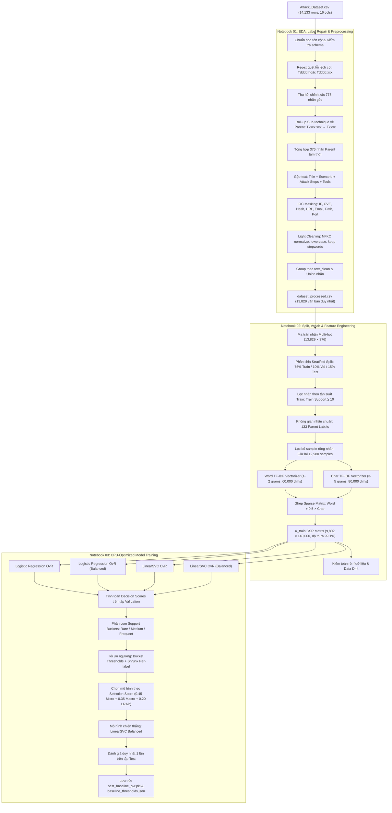
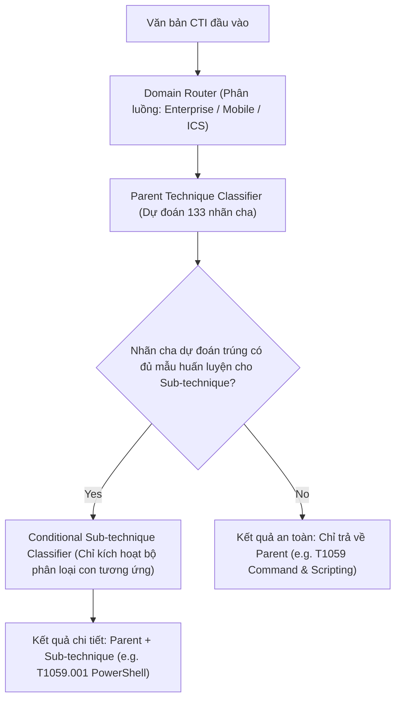

# Chi tiết Kiến trúc & Luồng xử lý Pipeline: Phân loại CTI sang MITRE ATT&CK

Tài liệu này hệ thống hóa toàn bộ kiến trúc kỹ thuật của dự án thành các sơ đồ luồng (Pipeline Flowcharts) chi tiết kèm giải thích kỹ thuật chuyên sâu. Tất cả các giai đoạn từ làm sạch dữ liệu thô, trích xuất đặc trưng lai 140,000 chiều, huấn luyện mô hình học máy trên CPU cho đến quy trình suy luận thời gian thực đều được minh họa rõ ràng.

---

## 1. Luồng Huấn luyện End-to-End (Training Pipeline)

Quy trình huấn luyện được chia thành 3 Notebook chuẩn hóa, đảm bảo tính toàn vẹn dữ liệu và chống rò rỉ (no data leakage).

### 💡 Điểm kỹ thuật cốt lõi trong Training Pipeline:
1. **Khắc phục lỗi cấu trúc CSV (Notebook 01):** Thu hồi 128 văn bản bị xô lệch cột bằng thuật toán quét RegEx hàng ngang, giúp giữ lại các chiến dịch tấn công quan trọng.
2. **Roll-up nhãn Parent (Notebook 01 & 02):** Thay vì phân loại hàng trăm nhãn con thưa thớt, việc gom nhóm về 133 nhãn cha giúp mô hình học các ranh giới quyết định (decision boundary) vững chắc hơn trên CPU.
3. **Bộ đặc trưng Lai 140,000 chiều (Notebook 02):** Sử dụng `char_weight = 0.5` để kết hợp từ khóa kỹ thuật (Word n-gram) và biến thể gõ sai/ẩn giấu (Char n-gram). Toàn bộ được giữ ở định dạng thưa `CSR Matrix` để tránh tràn RAM.

---

## 2. Luồng Suy luận Thời gian thực (Real-time Inference Pipeline)

Quy trình nhận một văn bản CTI báo cáo hoàn toàn mới, xử lý qua pipeline đã huấn luyện và xuất ra danh sách kỹ thuật tấn công chính xác.

```mermaid
flowchart LR
    A["Raw CTI Text (Báo cáo thô)"]
    B["NFKC Normalize & Lowercase"]
    C["IOC Masking (Thay thế IP, CVE...)"]
    D["Light Cleaning (Giữ từ khóa kỹ thuật)"]
    E1["Word TF-IDF Transform (60k dims)"]
    E2["Char TF-IDF Transform (80k dims)"]
    F["Ghép thưa: Word + 0.5 × Char (140k dims)"]
    G["LinearSVC Balanced (133 bộ phân loại OvR)"]
    H["Decision Scores (Điểm quyết định cho 133 nhãn)"]
    I["Đối chiếu với Per-label Thresholds đã học"]
    J{"Score ≥ Threshold?"}
    K["Giữ nhãn (Positive)"]
    L["Loại nhãn (Negative)"]
    M["Sắp xếp theo Margin = Score − Threshold"]
    N["Kết quả Top-K Confident Labels (e.g. T1003, T1047)"]

    A --> B --> C --> D
    D --> E1
    D --> E2
    E1 --> F
    E2 --> F
    F --> G --> H --> I --> J
    J -- Yes --> K --> M --> N
    J -- No --> L
```

### 💡 Lưu ý vận hành Inference:
* **Tính nhất quán:** Dữ liệu đầu vào bắt buộc phải đi qua đúng hàm `mask_entities()` và `clean_text()` của lúc huấn luyện. Việc tự ý bỏ stopword hoặc dùng bộ tokenizer khác sẽ làm lệch không gian 140,000 chiều dẫn đến sai lệch kết quả.
* **Bản chất Decision Score:** Output của `LinearSVC` là khoảng cách đến siêu phẳng quyết định (hyperplane margin), không phải xác suất phần trăm (`0.0 -> 1.0`). Sắp xếp theo `Margin = Score - Threshold` là cách tối ưu nhất để chọn ra Top-K nhãn tin cậy.

---

## 3. Kiến trúc Phân loại Phân cấp trong Tương lai (Hierarchical Architecture)

Để giải quyết triệt để bài toán phân loại đến tận nhãn con (Sub-technique như `T1565.001`) mà không bị F1 = 0 do thiếu dữ liệu, kiến trúc hệ thống tương lai được thiết kế theo hướng định tuyến phân tầng.

### 💡 Lợi ích của mô hình Phân cấp:
1. **Giảm không gian tìm kiếm:** Thay vì 1 bộ phân loại phải chọn giữa 500+ nhãn con, hệ thống chỉ cần đoán đúng 1 nhãn cha (trong 133 nhãn), sau đó kích hoạt một model nhỏ chỉ phân loại 3-5 nhãn con thuộc cha đó.
2. **Đảm bảo độ an toàn (Graceful Degradation):** Nếu dữ liệu về một biến thể tấn công mới quá hiếm, hệ thống vẫn trả về chính xác nhãn cha để chuyên gia SOC kịp thời xử lý, thay vì đoán sai hoàn toàn.

---

## 4. Bản đồ Tài nguyên & Mô hình (Artifact Map)

Toàn bộ các file được sinh ra và duy trì qua các giai đoạn pipeline:

| Đường dẫn file | Vai trò trong hệ thống | Kích thước / Định dạng |
| :--- | :--- | :--- |
| `Dataset/processed/dataset_processed.csv` | Dữ liệu văn bản đã làm sạch cùng nhãn Parent chuẩn | CSV Text |
| `Dataset/processed/label_vocab.json` | Danh sách 133 nhãn Parent chuẩn hóa theo thứ tự | JSON Array |
| `Dataset/processed/X_train.npz` | Ma trận đặc trưng huấn luyện thưa 140,000 chiều | Scipy CSR Matrix (~14MB) |
| `Dataset/processed/Y_train.npy` | Ma trận nhãn nhị phân Multi-hot | Numpy Array |
| `models/word_tfidf_vectorizer.pkl` | Bộ biến đổi từ khóa Word n-gram (60,000 dims) | Python Pickle (~2.2MB) |
| `models/char_tfidf_vectorizer.pkl` | Bộ biến đổi ký tự Char n-gram (80,000 dims) | Python Pickle (~2.4MB) |
| `models/feature_config.json` | Cấu hình tham số nối ma trận và trọng số `char_weight` | JSON Configuration |
| `models/best_baseline_ovr.pkl` | Mô hình học máy chiến thắng `LinearSVC_balanced` | Python Pickle (~140MB) |
| `models/baseline_thresholds.json` | Ngưỡng quyết định tối ưu cho từng nhãn trong 133 nhãn | JSON Map |
